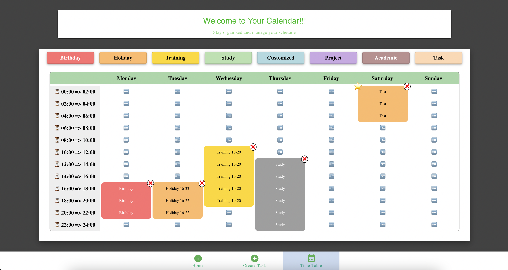

# Time Management App

Welcome to the Time Management App repository! This project aims to develop a robust time management application offering users a seamless experience in organizing, scheduling, and managing events via an intuitive calendar-based interface.

## Project Overview

The primary goal of this project is to create a user-friendly time management application catering to a wide audience. By focusing on UI golden rules for general audiences, our aim is to design an application that meets the diverse needs of users, providing efficient event management tools in a straightforward and intuitive manner.

## Key Features

- **Event Creation:** Create events with details such as Name, week day, time, isImportant, and event type selection.
- **Calendar View Dashboard (Weekly-Based):** Provides a weekly overview of scheduled events, enabling users to manage their schedules effectively.
- **Multiple Event Types:** Supports different event categories/types for easy organization and identification.
- **Personal Customization (Optional/ Implemented soon):** Allows users to customize their preferences, set reminders, and personalize their event management experience.

## Website Main Components

- **Header/Footer/NavigationBar:** Navigational elements ensuring ease of movement across the website.
- **Calendar:** Displays the weekly schedule and enables event creation or editing.
- **Tooltip:** Demonstrate 8 different event types that are selectable.
- **WarningPopUp (Optional/ Implemented soon):** Alerts users with warnings or confirmation prompts during critical actions.
- **Filter/SearchBar (Optional/ Implemented soon):** Allows users to filter or search for specific events based on criteria.

## Target Audience

This time management application caters to the following audience segments:

- Event Organizers and Planners
- Educational Institutions (Schools, Colleges, Academic events, Students organizations, etc.)
- Anyone seeking to better organize their timetable or interested in trying out an efficient time management application

© 2023 Thao Nguyen 🤝 Tri Nguyen
